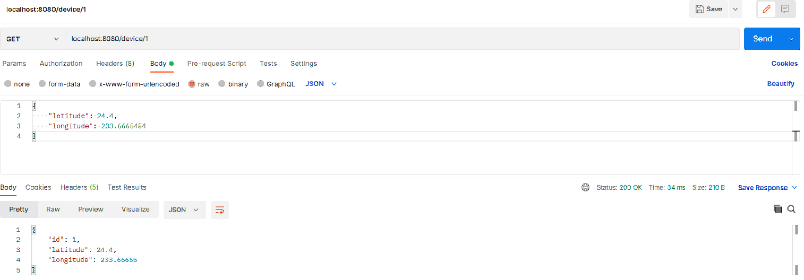

# GeoLocation - REST API

---

Application used to receive and save information about position (geolocation data) of mobile devices such as:
Mobile phone or GPS device.


## Table of Contents

---

* [General Info](#general-information)
* [Technologies Used](#technologies-used)
* [Setup](#setup)
* [Usage](#usage)
* [Project Status](#project-status)
* [Contact](#contact)
<!-- * [License](#license) -->


## General Information

---

- Provide an efficient REST API using Spring framework
- Creating and receiving geo-localization from geo-devices
- Writing the application according to best practices and test coverage


## Technologies Used

---

#### General

- Spring Boot
- Java 11
- Maven
- Logger

#### Database

- PostgreSQL
- Hibernate
- Flyway
- JPA
- Spring Data
- JDBC

#### Tools

- JSON
- Lombok

#### Test

- Mockito
- JUnit5
- MockMvc


## Setup

---

In order for the application to work properly there is a need of docker with PostgreSQL database:
- Install docker on your operating system
- Run this command in the command line:
```sh
docker run --name postgres -p 5432:5432 -e POSTGRES_PASSWORD=postgres postgres:13.2
```

---
In order to connect to the Database there is need to put in those credentials:
- user - postgres
- password - postgres

The application runs under this url address:
```sh
localhost:8080/device
```

## Usage
You can test the Application for example in Postman:
- There is no need to put in the id value because it is auto-incremented
- To create device with proper longitude and latitude parameters:
```sh
POST /device
```

To receive the device you need to put the id of the device in place of {id}:
```sh
GET /device/{id}
```



## Project Status

---

Project is: complete but created in a way that it is open for future extension, upgrade and development.

## Contact

---

[@Radoslaw Piwowarczyk](https://www.linkedin.com/in/radoslaw-piwowarczyk/) - feel free to contact me!
